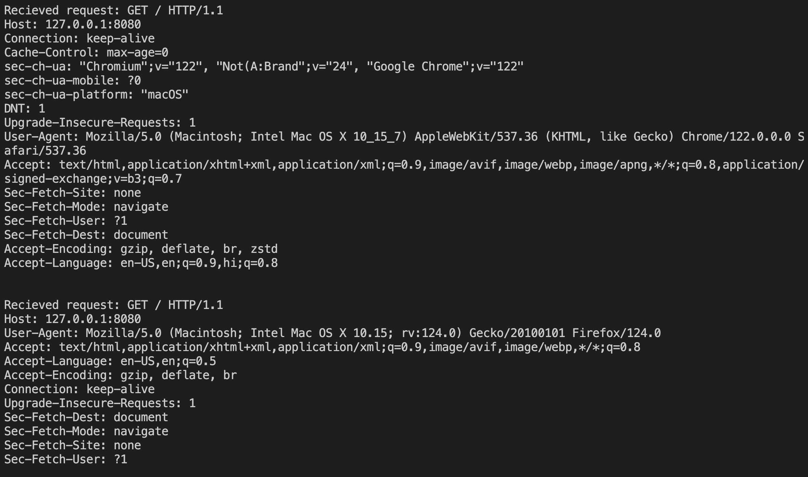
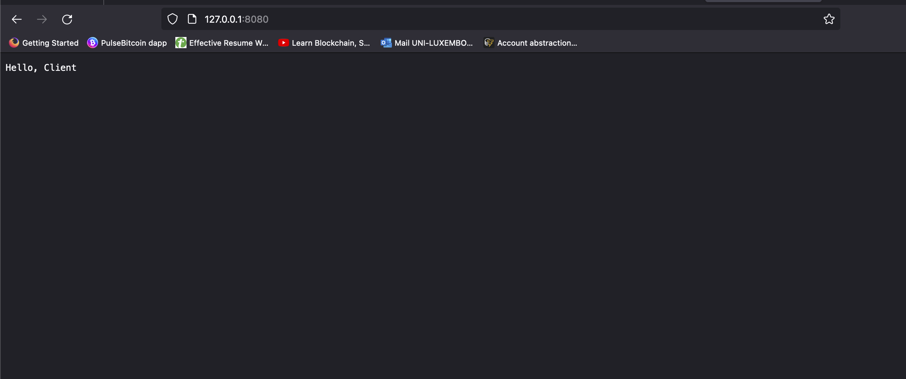

# TCP SERVER in Rust Programming Language

I created a rust based TCP server which on a high-level creates a server and listen to it's client and whehn you connect to the endpoint it records the connection on the server with the detail of the client's OS and browser. 

- Here's the server listening for connections

- The connection established on the client side.

